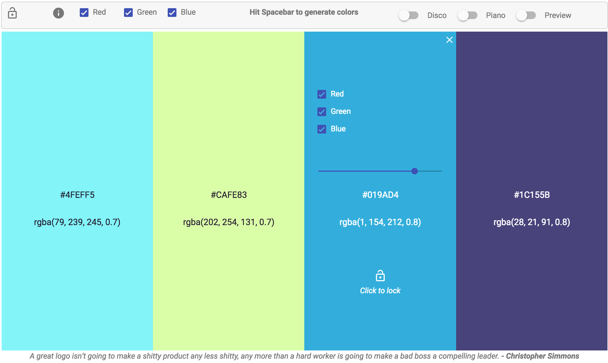

<p align="center">
	
</p>

## ColorSchemr

Color palettes one will fall in love with. Generate your always aspiring Color Scheme with jaw-dropping feature list.



Started as an [Angular2 Hackathon Project](https://www.angularattack.com/entries/2853-angoor), motivated us to launch it as a product to be easily accessible to public.

### Features

* **Generate Palettes**

	Hit spacebar to generate new palettes

* **Add / Remove Strips**

	Add to front / last (Upto a maximum of 10 strips), remove any strip

* **Color Range**

	Get Colors from a specified range of [R, G, B]. Just select your preference

* **Lock / Unlock**

	Control whether hitting spacebar should update strip's color

* **Color Codes**

	Each strip color in Hex and RGB code

* **Adjust Opacity**

	Adjust strip opacity by dragging the slider

* **Random Quote**

	A color quote with each new palette generation

* **Global Settings**

	Lock / Unlock / Adjust Color Range for all Strips

* **Disco Mode**

	Automatic palette generation in a loop

* **Piano Mode**

	Automatic random strip changes color in a loop

* **Preview Mode**

	Preview how colors would look on a minimalistic template

* **Gradient Mode**

	Blend colors to view it as gradient strip (works best with two colors)

* **Key bindings**

	Change particular strip color by pressing number keys (0-9). 1 for first strip...0 for tenth

* **Responsive**

	Cross platform responsive app


### Installation

* Clone the project

	```
	git clone https://github.com/softvar/colorschemr.git
	```

* Install the dev-dependenices

	```
	npm install
	```

* Now start the webpack server

	```
	npm start
	```

Happy Coding :)


### Contributors

1. [Varun Malhotra](https://github.com/softvar) - [Twitter](https://twitter.com/s0ftvar)
2. [Gaurav Nanda](https://github.com/gauravmuk) - [Twitter](https://twitter.com/gauravmuk)

### Contribution

* Clone this repo
* Create a new branch(prefixing your github username). For eg. softvar-fixed-typo or softvar-updated-list
* Update the list of products or any cosmetic fix
* Please verify your changes.
* `git commit -am "Added a new feature - [feature-name]"`
* `git push origin [branch-name]`

* Open a Pull Request(PR)
* Please write a meaningful description for the PR and you're done :)

### Instructions for using it

* Hitting the main url will open up the Landing Page. Color Schemr offers a good range of features. One can read about them on LP.
* Navigate to the main app or visit the about section to know more about the developers and a bit about our app.
* While on the main app's page, one can simply view the default random generated Color Palette, a random color quote along with a bunch of controls.

**CONTROLS**

* Hitting spacebar each time will generate a new color palette along with each strips' **RGB and HEX code**.

* Hover over a Strip to get more controls over it. One can **lock** a strip by clicking on a strip to restrict a strip's color getting updated on pressing spacebar from that point onwards. **Unlock** the same to restore the original state.

* Adjust **opacity** by dragging the slider, by default the opacity is 1 i.e. rgba's **a** is set to 1.

* By default R,G and B components of a color are set to true which means color could be any, **selecting / deselecting particular component** will result in generating colors from that range only. Eg: Only R component will generate the colors having the RED component only, similarly R and G will generate colors having Re and Green Component and so on...

* While hovering, one can opt to remove strip by clicking on a close icon on top right of each hovered strip.

* Click on plus icon on the leftmost to **add a strip to the front**.

* Click on plus icon on the rightmost to **add a strip to the last**.

* Bar above the strip is **Global settings** which will apply to all the strips. For eg: selecting just the *B* component of RGB will result in a generation of colors with just blue variants. Similarly for Lock / Unlock.

* Switching on the **Disco mode** will result in auto-generation of color palettes in an interval of 1 second.

* Switching on the **Piano mode** will result in auto-updating of random strip's color in a loop.

* Toggling **Preview mode** helps use to preview how the colors would look on a very minimalistic template.

That's all ! Enjoy our app and Please **vote / share** if you find it useful / having fun or any other reason which we would love to hear :)

### Tech Stack

**Framework**

* Angular2 rc-1 - [https://angular.io/}(https://angular.io/)
* RXJS
* See list of dev-dependencies and external dependecies here - [https://github.com/rumblex/angularattack2016-colorschemr/blob/master/package.json](https://github.com/rumblex/angularattack2016-colorschemr/blob/master/package.json
)

**Languages**

* **TypeScript**, **ES6** being used to write the entire code

**Tutorials - Video / Otheres**

* Rangle - [http://ngcourse.rangle.io/](http://ngcourse.rangle.io/)
* egghead.io - [https://egghead.io](https://egghead.io)

**Seed Project**

* Angular2-Seed - [https://github.com/angular/angular2-seed](https://github.com/angular/angular2-seed)

**Theme & Landing Page Template Help**

* Material Design Lite - [http://www.getmdl.io/](http://www.getmdl.io/)

**Fonts and Icons**

* Material Design Lite - [http://www.getmdl.io/](http://www.getmdl.io/)
* Font Awesome - [http://fontawesome.io/](http://fontawesome.io/)

**For bundling resources**

* Webpack - [https://webpack.github.io/](https://webpack.github.io/)

**Google Analytics**

* For visitors tracking - [https://analytics.google.com/analytics/web/](https://analytics.google.com/analytics/web/)

### License

The MIT License (MIT)

Copyright (c) 2016 Varun Malhotra

Permission is hereby granted, free of charge, to any person obtaining a copyof this software and associated documentation files (the "Software"), to dealin the Software without restriction, including without limitation the rightsto use, copy, modify, merge, publish, distribute, sublicense, and/or sellcopies of the Software, and to permit persons to whom the Software isfurnished to do so, subject to the following conditions:

The above copyright notice and this permission notice shall be included in allcopies or substantial portions of the Software.

THE SOFTWARE IS PROVIDED "AS IS", WITHOUT WARRANTY OF ANY KIND, EXPRESS ORIMPLIED, INCLUDING BUT NOT LIMITED TO THE WARRANTIES OF MERCHANTABILITY,FITNESS FOR A PARTICULAR PURPOSE AND NONINFRINGEMENT. IN NO EVENT SHALL THEAUTHORS OR COPYRIGHT HOLDERS BE LIABLE FOR ANY CLAIM, DAMAGES OR OTHERLIABILITY, WHETHER IN AN ACTION OF CONTRACT, TORT OR OTHERWISE, ARISING FROM,OUT OF OR IN CONNECTION WITH THE SOFTWARE OR THE USE OR OTHER DEALINGS IN THESOFTWARE.